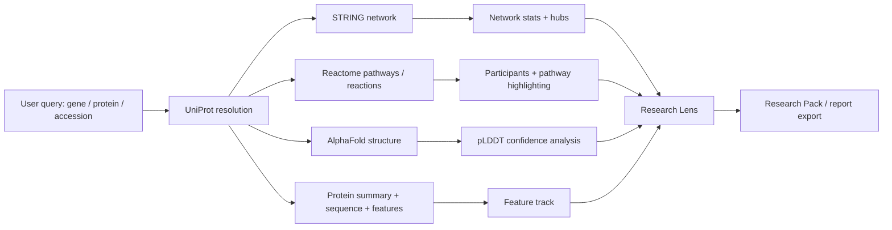

# Kai9987kai BioExplorer Research Lens

**Kai9987kai BioExplorer Research Lens** is a single-file, browser-based protein intelligence dashboard that connects live biological data sources into one interactive research workflow.

It lets you enter a gene name, protein name, or UniProt accession and explore the result through **UniProt annotations**, **STRING interaction networks**, **Reactome pathways**, **AlphaFold structures**, **protein feature tracks**, and a new **Research Lens** that turns the loaded evidence into transparent research heuristics and exportable hypotheses.

> Built as a standalone HTML app. No backend, no build step, no database, and no account required.

---

## What this project does

BioExplorer is designed for fast exploratory biology work. Instead of jumping between multiple scientific websites, the app pulls key evidence into one visual interface:

- **UniProt** for protein identity, function, sequence, organism, and feature annotations.
- **STRING** for functional or physical protein interaction networks.
- **Reactome** for pathway and reaction mapping.
- **AlphaFold DB** for predicted 3D structures, pLDDT confidence, and PAE-related metadata where available.
- **Cytoscape.js** for interactive network exploration.
- **3Dmol.js** for browser-native molecular structure viewing.

The goal is not to replace specialist databases. The goal is to create a **fast, visual, evidence-linked research cockpit** for understanding proteins, pathways, structure confidence, and network context in one place.

---

## Current feature set

### Protein search and resolution

- Search by gene symbol, protein text, or UniProt accession.
- UniProt-backed autocomplete suggestions.
- Species selector with common model organisms:
  - Human
  - Mouse
  - Rat
  - Zebrafish
  - Drosophila
  - C. elegans
  - Yeast
  - Arabidopsis
- Reviewed-entry preference when resolving UniProt results.
- Share-link support for reproducible searches.

### Protein summary panel

- Protein name.
- Gene symbols and synonyms.
- Organism and taxonomy ID.
- Sequence length.
- UniProt function summary.
- Direct UniProt link.
- Quick metrics for pathways, network size, AlphaFold status, network density, pLDDT, and enrichment.

### STRING network explorer

- Interactive protein interaction graph.
- Functional or physical network mode.
- Adjustable STRING score threshold.
- Adjustable neighbor count.
- Network statistics:
  - Nodes
  - Edges
  - Density
  - Average degree
  - Connected components
- Top hub detection by degree.
- Node search and focus.
- Clickable node details.
- Clickable edge evidence details.
- Network relayout and fit controls.
- Export network as JSON.
- Export network as PNG.

### Reactome pathway mapping

- Map the loaded UniProt protein to Reactome pathways.
- Switch between pathway and reaction views.
- Filter mapped events.
- Fetch participants for a selected Reactome event.
- Open selected events in Reactome.
- Highlight pathway participants inside the STRING network.
- Node-to-pathway lookup from selected STRING nodes.

### AlphaFold structure view

- Fetch AlphaFold prediction metadata by UniProt accession.
- Render the structure in the browser using 3Dmol.js.
- Display model metadata.
- Parse and summarize pLDDT confidence values.
- Show low-confidence sequence segments.
- Support PAE image display when metadata provides it.
- Link structure confidence back into the feature track.

### UniProt feature track

- Visual feature map for the loaded protein sequence.
- Feature filtering:
  - All features
  - Domains / regions
  - Sites / PTMs
- Click a feature to jump to the relevant sequence window.
- Tooltip-style feature detail inspection.
- AlphaFold confidence overlays for low-confidence regions.
- Sequence/FASTA panel for fast inspection.

### Notes and reports

- Auto-generated Markdown report from the loaded evidence.
- Editable report text area.
- Downloadable `report.md`.
- Freeform notes panel.
- Downloadable `notes.md`.
- Copy controls for report and notes.

---

## New: Research Lens

The upgraded Research Lens is the main innovation layer.

It takes the evidence already loaded from UniProt, STRING, Reactome, and AlphaFold and turns it into transparent, non-black-box research heuristics.

### Research Lens includes

- **Evidence scorecards** for structure, network, pathway, and hotspot context.
- **STRING enrichment snapshot** for network-level biological themes.
- **Hypothesis builder** that generates explainable next-step research ideas.
- **AlphaFold pLDDT ↔ UniProt feature overlap scan** to flag regions where low-confidence structure overlaps annotated features, domains, PTMs, or motifs.
- **Reactome vs STRING gap scan** to identify selected-pathway participants not currently visible in the STRING neighborhood.
- **Research Pack export** as Markdown.

The Research Lens is intentionally labelled as a **research aid**, not a diagnostic or clinical interpretation system.

---

## Why it is useful

BioExplorer helps answer questions like:

- What does this protein do?
- Which proteins are nearby in its interaction network?
- Which nodes are the strongest hubs?
- Which Reactome pathways or reactions involve this protein?
- Are pathway participants missing from the visible STRING neighborhood?
- Does the AlphaFold model suggest confident domains or flexible/low-confidence regions?
- Do low-confidence regions overlap UniProt features such as PTMs, motifs, or regulatory regions?
- What evidence-backed hypotheses should be investigated next?

---

## How the workflow fits together



---

## Quick start

### Option 1: Open directly

Open the HTML file in a modern browser.

```text
kai9987kai_bioexplorer_research_lens.html
```

Some browsers may block API calls when running from `file://`.

### Option 2: Run with a local server

Recommended:

```bash
python -m http.server 8000
```

Then open:

```text
http://localhost:8000/kai9987kai_bioexplorer_research_lens.html
```

### Try these examples

```text
TP53
BRCA1
PTEN
EGFR
P04637
```

For most testing, use:

```text
TP53 + Human + STRING score 700 + 20 neighbours
```

---

## Controls

| Control | Purpose |
|---|---|
| Gene / UniProt / text | Search query for protein resolution |
| Species | Restrict search/network/pathway mapping by taxonomy ID |
| STRING score | Minimum STRING confidence score |
| Neighbors | Number of added STRING neighborhood nodes |
| Network type | Switch between functional and physical network context |
| Example | Load a demo protein |
| Copy share link | Copy URL state for reproducible exploration |
| Clear cache | Clear local cached API responses |

---

## Exports

BioExplorer exports useful research artefacts directly from the browser:

| Export | Description |
|---|---|
| Network JSON | Graph data for reuse or analysis |
| Network PNG | Image of the current Cytoscape graph |
| Report.md | Auto-generated loaded-protein report |
| Research Pack.md | Research Lens scorecards, enrichment, gaps, overlaps, and hypotheses |
| Notes.md | User-authored notes |

---

## Data sources

BioExplorer uses public biological data APIs:

- [UniProt REST API](https://rest.uniprot.org/)
- [STRING API](https://string-db.org/help/api/)
- [Reactome Content Service](https://reactome.org/ContentService/)
- [AlphaFold Protein Structure Database API](https://alphafold.ebi.ac.uk/)

The app requests data client-side from the browser. Availability depends on the uptime, rate limits, CORS behaviour, and response formats of these services.

---

## Tech stack

- Single-file HTML/CSS/JavaScript.
- No Node build pipeline required.
- No backend server required.
- Cytoscape.js for network visualisation.
- 3Dmol.js for structure rendering.
- Browser `fetch()` for API calls.
- `localStorage` for temporary API caching and notes-style persistence.
- SVG for protein feature visualisation.

---

## Architecture overview

The app is organised around one shared state object:

```text
app.state
├── queryRaw
├── taxId
├── uniprot
├── uniprotSummary
├── features
├── string
│   ├── requiredScore
│   ├── neighbors
│   ├── networkType
│   ├── elements
│   ├── hubs
│   └── enrichment
├── reactome
│   ├── mode
│   ├── items
│   ├── selected
│   ├── participants
│   └── highlightSet
├── alphafold
│   ├── meta
│   ├── pdbUrl
│   ├── paeImageUrl
│   ├── plddt
│   └── plddtSummary
├── report
└── notes
```

The main loading pipeline resolves the query through UniProt, then launches the network, pathway, structure, feature, report, and Research Lens modules around the resolved accession.

---

## Research Lens methodology

The Research Lens does not invent biological facts. It summarises evidence already loaded in the current session.

It uses simple, inspectable heuristics such as:

- Number of mapped Reactome events.
- STRING network density and hub degree.
- Mean STRING edge confidence.
- STRING enrichment terms and FDR values.
- AlphaFold mean pLDDT.
- Low-confidence pLDDT segment detection.
- Overlap between low-confidence segments and UniProt features.
- Difference between selected Reactome participants and visible STRING nodes.

The output should be treated as a triage layer for generating better questions, not as proof of mechanism.

---

## Privacy and local behaviour

- No custom backend is used.
- Queries are sent from the browser to the public APIs listed above.
- Export files are generated locally in the browser.
- Cache data is stored in `localStorage` and can be cleared from the app.
- No account or login is required.

---

## Limitations

- API responses may change over time.
- Some accessions may not have AlphaFold predictions.
- Some Reactome mappings may be sparse depending on organism and identifier.
- STRING edges represent evidence-backed associations, not guaranteed direct physical binding unless using the physical network mode.
- pLDDT is a confidence measure, not a direct disorder score.
- Enrichment and hypothesis outputs are exploratory and should be validated experimentally or with domain-specific review.
- Running the file directly through `file://` may trigger browser CORS restrictions.

---

## Suggested roadmap

### Research features

- Add evidence provenance panels for every hypothesis.
- Add support for comparing two proteins side-by-side.
- Add batch mode for multiple genes.
- Add GO term and disease annotation panels.
- Add orthologue comparison across species.
- Add motif-aware low-confidence region analysis.
- Add export to Cytoscape-compatible formats.

### Interface improvements

- Add light/dark theme toggle.
- Add keyboard shortcuts.
- Add session restore.
- Add offline demo fixtures.
- Add guided onboarding for first-time users.
- Add compact/mobile layout refinements.

### Scientific workflow improvements

- Add confidence labels for each data source.
- Add pathway overlap comparison between multiple selected events.
- Add enrichment category grouping.
- Add local “research notebook” history.
- Add citation-ready export format.

---

## Example research workflow

1. Search for `TP53` in human.
2. Review the UniProt function summary.
3. Inspect the STRING network and identify top hubs.
4. Open Reactome pathways and select a relevant event.
5. Highlight the event participants in the network.
6. Load the AlphaFold structure and inspect pLDDT confidence.
7. Open the Features tab and compare UniProt annotations against confidence overlays.
8. Open Research Lens.
9. Review enrichment, overlaps, pathway/network gaps, and hypotheses.
10. Export `Research Pack.md` for follow-up analysis.

---

## Repository structure

```text
.
├── index.html                                  # recommended deploy target
├── kai9987kai_bioexplorer_research_lens.html  # standalone app file
└── README.md
```

For GitHub Pages, either rename the app file to `index.html` or set your deployment entry point to the generated HTML file.

---

## Deployment

### GitHub Pages

1. Put the app file in the repository root.
2. Rename it to `index.html`.
3. Commit and push.
4. Enable GitHub Pages from the repository settings.
5. Open the published page and test with `TP53`.

### Static hosting

The app can also be hosted on any static host, including:

- GitHub Pages
- Netlify
- Vercel static output
- Cloudflare Pages
- Local intranet server
- Simple Python HTTP server

No server-side code is required.

---

## Development notes

Because the project is intentionally single-file, changes can be made directly in the HTML file.

Recommended checks after editing:

```bash
node --check extracted_script.js
python -m http.server 8000
```

Then test:

- Search and load `TP53`.
- Confirm UniProt summary loads.
- Confirm STRING network renders.
- Confirm Reactome pathways populate.
- Confirm AlphaFold view loads when available.
- Confirm Research Lens updates.
- Confirm exports download correctly.

---

## Disclaimer

BioExplorer is for research exploration, education, and hypothesis generation. It is not a medical device, diagnostic system, treatment recommendation engine, or substitute for expert biological or clinical review.

---

## License

Add your preferred license here.

Suggested for open-source release:

```text
MIT License
```

---

## Credits

Built by **Kai9987kai** as an experimental biology-first research interface combining protein annotation, pathway context, interaction networks, structure confidence, and transparent heuristic hypothesis generation in a single-file web app.
